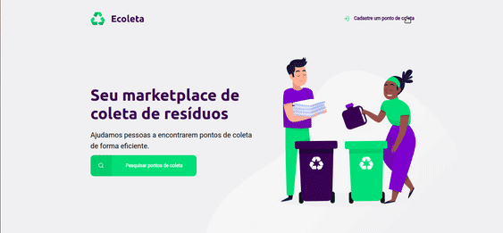

#  Ecoleta

## Descrição
O Ecoleta foi desenvolvido juntamente com o pessoal da Rocketseat na primeira edição do evento Next Level Week. Ele é uma plataforma de coleta de resíduos, destinada a busca por pontos de reciclagem, onde usuários podem buscar por pontos de acordo com as cidades e as empresas podem realizar o cadastro do seu ponto com dados de endereço e quais materiais reciclam. 

A aplicação foi desenvolvida em HTML, CSS e Javascript, onde fizemos seu backend utilizando node.js e um database.

## Índice
- [Requisitos](#Requisitos)
- [Instalação](#Instalação)
- [Uso](#Uso)
- [Imagens](#Imagens)


## Requisitos
- Siga os passos de instalação abaixo. 


## Instalação
- Utilizar o comando
  - No terminal, utilizar o comando: 

  ``` 
  npm install 
  ```
Obs: Ele é responsável por instalar todas as dependências de desenvolvimento utilizadas no projeto. Elas serão responsáveis pelo seu funcionamento correto.  


## Uso
Para rodar a aplicação:
- No terminal, utilize o comando:
```
npm start
```

A aplicação estará disponível em `http://localhost:3000/`

## Imagens

Veja abaixo um breve gif com o funcionamento do projeto

<p align="center">
  
</p>


